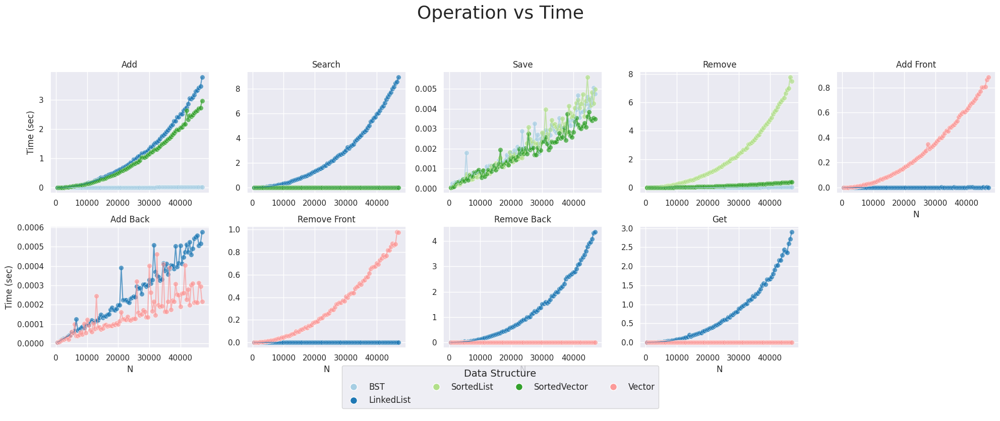
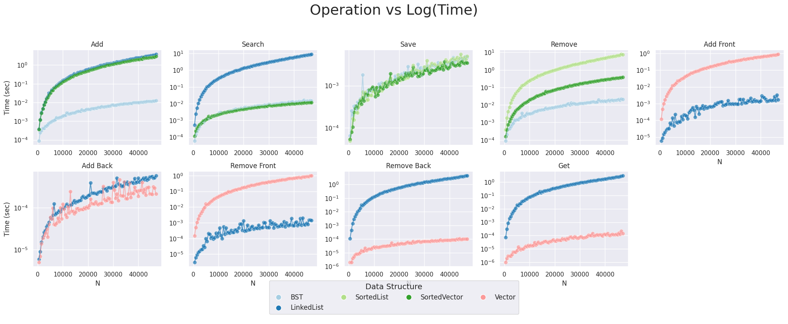
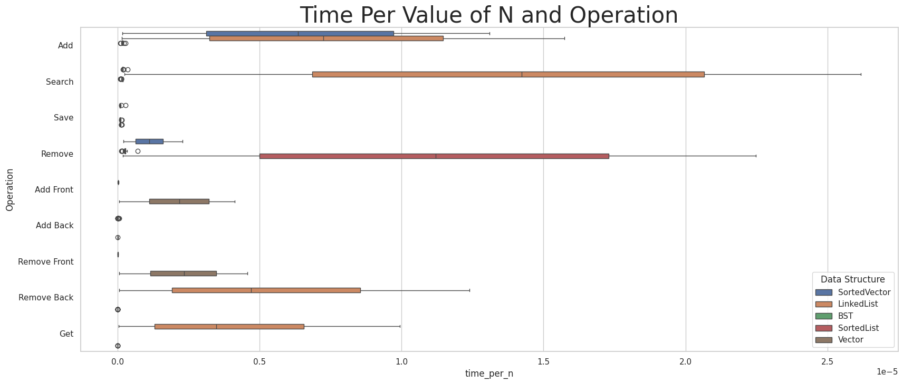
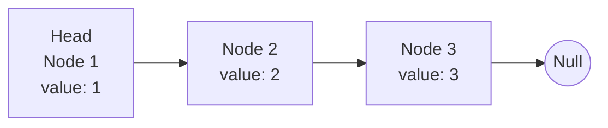

# Report for Data Structure Speed Comparison Homework

Make sure to answer every question in this homework. You should not bullet point your answers, but
instead write them as a full report format. This doesn't mean you have to be wordy, as concise is good,
but it does mean you need to use proper grammar, spelling, and be complete. For question that just
ask for a short answer, answer accordingly. Make sure to include references where appropriate.

## Algorithmic Analysis - Big $O$

Complete the Big O table below for the following functions. You may use any resource you like, but
for the SortedVector and SortedList, you should use the Big O for the functions you wrote in the
the homework. Both Single and Double Linked List you can assume head and tail pointers are available. 
Don't forget to use latex math notation (example in the table).

### Big $O$ Table

| -                         | Add/Insert | Remove | Search/Find | Sort   | Add Front | Add Back | Remove Front | Remove Back | Get by Index |
| ------------------------- |:----------:|:------:|:-----------:|:------:|:---------:|:--------:|:------------:|:-----------:|:------------:|
| Vector                    | $O(n)$     | $O(n)$ |    $O(n)$   |    $n \cdot log(n)$    |$O(n)$| amortized $O(1)$, worst $O(n)$|   $O(n)$    |    $O(1)$   |    $O(1)$    |
| Single Linked List        | $O(n)$     | $O(n)$ |    $O(n)$   |  $n \cdot log(n)$       | $O(1)$    |   $O(1)$ |    $O(1)$    |   $O(n)$    |    $O(n)$    |
| Double Linked List        | $O(n)$     | $O(n)$ |   $O(n)$    |  $n \cdot log(n)$       | $O(1)$    | $O(1)$   |  $O(1)$      |   $O(1)$    |   $O(n)$     |
| Sorted Vector             | $O(n)$     | $O(n)$ |  $log(n)$   | $O(1)$ | ---       | ---      | ---          | ---         | ---          |
| Sorted Single Linked List | $O(n)$     | $O(n)$ |  $O(n)$     | $O(1)$ | ---       | ---      | ---          | ---         | ---          |
| Sorted Double Linked List | $O(n)$     | $O(n)$ | $O(n)$      | $O(1)$ | ---       | ---      | ---          | ---         | ---          |
| Binary Search Tree        |  amortized $O(log(n))$, worst $O(n)$  | amortized $O(log(n))$, worst $O(n)$ | amortized $O(log(n))$, worst $O(n)$ | $O(n)$ | ---       | ---      | ---          | ---         | ---          |

For Sort, we are asking for the Big $O$ for taking the current data structure and writing it 'sorted' to a file. However, not the file writes. For example, if you have a vector of 1000 elements, and you want to write it to a file, you would need to sort it first. So, the Big $O$ for this would be the Big $O$ for sorting. For BST, you have to convert the tree to a sequential structure, so the cost of doing that.  

### Assumptions with Sort

Since the worst case can change considerably based on what sort you use for sorting (if any), list each algorithm below, and specify the algorithm used in your assumption.  For BST, write which  method of traversal you would use to sort it.  

*	Vector: Using the merge sort algorithm, we can assume that we can write these values in $n\cdot\log(n) $
*	Single Linked List: We can assume that we can write these values in $n\cdot\log(n) $ by using the merge sort algorithm. We can implement merge sort on a linked list directly, or we can convert a linked list to an array and back again in $O(n)$.
*	Double Linked List: We can assume that we can write these values in $n\cdot\log(n) $ by using the merge sort algorithm. We can implement merge sort on a linked list directly, or we can convert a linked list to an array and back again in $O(n)$.
*	Sorted Vector - already sorted
*	Sorted Single Linked List - already sorted: $O(n)$ since we are writing to a file
*	Sorted Double Linked List - already sorted: $O(n)$ since we are writing to a file
*	Binary Search Tree: We can assume in order traversal. BST trees are already in order, so the cost here is writing to a file, which would be $O(n)$.

source:https://www.youtube.com/watch?v=8ocB7a_c-Cc


### Worst Case vs. Average Case

There are a few functions whose worse case is very different than the average case. Name at least two of them, and explain why the worse case is so much worse than the average case. 

1. Binary Search Tree: 
For the Operations `Add/Insert`, `Search/Find`, and `Remove`, we have different runtimes depending on whether we are looking at amortized or not amortized. This is due to the structure  and make up of Tree before these operations take place. If we are given data that is already ordered, then we will essentially be creating a linked list. In this scenario, we inherit the runtime of the linked list, but if our data is randomized, then we can assume an amortized case. For example, if we insert a list of order numbers, let's say 10,9,8,7, and 6, the resulting tree will be:
   
   ```mermaid
   flowchart TD
      10 --> 9
      9 --> 8
      8 --> 7
      7 --> 6
   ```
2. Vector:
In the `our add back` operation for the vector data structure, we have an amortized runtime of $O(1)$ vs a worst-case of $O(n)$. This worst-case happens when we go over our vector’s capacity. Our vector is a fixed size, and when we reach that fixed size, we make a new array that is generally double the capacity. With this new array, we then copy the existing values from the old array into the new array. In this scenario, our worst case is $O(n)$, but generally adding to the back is $O(1)$.


## Empirical Analysis - Speed Comparison

For this section, you will need to have run the speed compare program and generated the output into a CSV file.

### Empirical Results Table

Add a link from this document to the CSV file you generated. The CSV file must have at least 15 different N values, but
often can have a lot more depending on what you ran.  

### Analysis

Create *at least three* graphics that each visually explain an aspect of your data related to an operation or data structure. Under each one, explain what the graphic is showing, and what you can conclude from it/what you find interesting about it.

> [!IMPORTANT]
> 
> Make sure you are comparing apples to apples and not apples to oranges when choosing what to put in the same graph. 
> 
> **:x: different data structures *and* different operations**
> 
> - Vector Add Front versus BST Add
> 
> **:white_check_mark: different operations *but* same data structure**
> 
> - BST Add versus Remove, and Search for BST
> 
> **:white_check_mark: different data structures *but* same operation**
> 
> - BST Add versus Add for Sorted Vector, and Sorted Single/Double Linked List
> 
> - Vector Add Front versus Add Front for Single/Double Linked List

> [!TIP]
> 
> To create the graphics you can use a third party program like Microsoft Excel or Google Sheets. (Completely optional if you want extra coding: you can use python libraries such as matplotlib, seaborn, or plotly)
> 
> Make sure you can see the image embedded in the Report.md using [image markdown] when you upload it to github, and get help if it doesn't show! 

#### Graphic 1 & Graphic 2:




For this analysis, we will analyze visuals one and two together, since they show similar information. Each graph in the visual above represents an operation performed during our analysis. Each line within the graph represents a particular data structure. For the purposes of this analysis, we will analyze one graph at a time.

* `Add`: This shows that the BST was our most performant data structure. Our sorted vector and linked list behaved similarly and had similar runtimes.

* `Search`: The sorted vector was our most performant data structure, but BST was a very close second. BST amortized search runtime is $O(\log n)$ while a sorted vector’s worst-case runtime using binary search is $O(\log n)$. We are surprised that the overhead between the data structures didn’t cause a more substantial difference in runtimes, and that BST’s worst case of $O(n)$ didn’t appear more often.

* `Save`: These runtimes were all roughly equivalent. Writing to a file should be $O(n)$ for all data structures.

* `Remove`: BST was the fastest at removing an element. I was surprised at how slow a sorted linked list was at removing an element.

* `Add Front`: As expected, adding to the front of a vector is much slower when compared to a linked list. For a vector, this runtime should be $O(n)$, and for a linked list, we expect $O(1)$.

* `Add Back`: Both runtimes were roughly equivalent with an $O(1)$ runtime. Surprisingly, our graph shows a linear runtime for both, but we believe this is merely overhead since the actual runtimes are very small.

* `Remove Front`: As expected, the runtime for a vector was very slow when removing from the front. This aligns with our expectation since removing from the front of a vector is guaranteed to be $O(n)$ time complexity, but for a linked list, this would be $O(1)$.

* `Remove Back`: As expected, our linked list was much slower at removing from the back, which is an $O(n)$ operation.

* `Get`: The linked list was the slowest at retrieving by index, which is an $O(n)$ operation. Our vector, as expected, showed constant runtime for retrieving by index.


#### Graphic 3:



This graph shows a box-and-whisker plot for each data structure and operation. Our runtimes have been normalized by dividing each runtime by $N$ to acquire the average runtime per value of $n$. This graph shows that there was a significant amount of variability when it came to searching for an element in a linked list. This graph really highlights where each data structure excels and where each algorithm has shortcomings.

## Critical Thought

### Data Evaluation

Answer the questions below. Make sure to answer each question fully, and explain your reasoning. Indent your answers immediately below the question, for it to line up with the bullet point.

For example:

```markdown
1. What is the most surprising result from the data? Why is it surprising?
   Answer here
```

1. What is the most surprising result from the data? Why is it surprising?
   What I found most surprising was how linear run time presented itself. At first, linear runtime has a curve to it, which intuitively means something is greater than an $O(n)$ runtime. I think this curve is merely the overhead cost and resource constraints, which is eventually trivialized as $n$ increases. I think this shows how hard it is to rely on only empirical data.

2. What data structure is the fast at adding elements (sorted)? Why do you think that is?

    Binary Search Tree (BST) was the fastest data structure at adding new elements. This aligns with our expectations since adding to a BST should be $O(\log(n))$ given that the tree is balanced. The add operation for a `BST` is determined by its height, while our other data structures maintain their sorted order with a worst case of $O(n)$ runtime.

3. What data structure is the fastest at removing elements (sorted)? Why do you think that is?

   Our most performant data structure for removing elements was a BST.  We were surprised at how fast a sorted vector was at removing sorted elements since this could be an $O(n)$ operation for the worst case.

4. What data structure is the fastest at searching? Why do you think that is?

   A sorted vector was slightly faster than a BST when searching for an element. The difference here could simply be noise because they should both run in $O(\log(n))$ given a balanced tree.

5. What data structure is the fastest for adding elements to the front? Why do you think that is?

   A linked list was the fastest data structure for adding to the front. For a linked list, adding to the front is a $O(1)$ worst-case compared to a vector, which is $O(n)$. To add to the front of a linked list, we merely create a new node and assign pointers. When we add to the front of a vector, we have to shift all values down by one spot, making this an $O(n)$ operation.

6. What data structure is the fastest for adding elements to the back? Why do you think that is?

   A vector, on average, was slightly faster at adding to the back. Although we noted a small difference between the two data structures, this could be attributed to noise, since the difference is small and their runtimes for this operation should be $O(1)$. We should note that a linked list would have more constant operations for this activity when compared to a vector, which could also be a factor.

7. What data structure is the fastest for removing elements from the front? Why do you think that is?

   A linked list was the fastest algorithm for removing the first element. For a linked list, this should be an $O(1)$ operation since it only needs to free a node and reassign the head pointer. For vectors, removing an element from the front is an $O(n)$ operation because all values must be shifted up.

8. What data structure is the fastest for removing elements from the back? Why do you think that is?

   The vector was the fastest data structure for removing from the front. Since vectors have direct access, removing from the back is an $O(1)$ operation. We used a singly linked list, and thus removing from the back is $O(n)$. Singly linked lists have this runtime, since they must traverse the entire data structure  to find the second to last node, which is then reassigned as the new tail node.

### Deeper Thinking

#### Double Linked List vs Single Linked List

1. If you wrote your linked list as a single linked list, removing from the back was expensive. If you wrote it as a double linked list, removing from the back was cheap. Why do you think that is?

With a doubly linked list we can traverse our dataset forward and backward, while a singly linked list we can traverse in the forward direction. Although we can access the last element of a singly linked list in $O(1)$ time, we cannot reassign the $(n-1)$ value as the last value without traversing the entire data structure. With a doubly linked list, removing the last element is trivial because we can go to the last element, then go to its previous node, assign it as the last value, and then remove the node. Given this information, removing the last node in a singly linked list has a time complexity of $O(n)$, while a doubly linked list’s time is $O(1)$.

2. When running most functions, at least ~30% of the tests were worse case scenarios. Why do you think that is?

Our sampling method for our datasets ensures that at least 30% of our searches and removals are based on a worst-case scenario. This is because 30% of our samples are not present in our samples, which means we have to search through every node before returning NULL.

3. What was done in the code to encourage that?

The function ` build_sample_indexes` suggests that 30% of our removals and searches are a worst-case scenario. In this function, the variable `SAMPLE_SPLIT` builds our experiment so that 70% of the samples will exist in the linked list while the 30% of the samples may or may not exist. Therefore, we are forced to traverse all nodes in order to determine that a value is not present in our linked list. 

4. How did this particularly influence the linked list searches?

The chart above shows us a basic singly linked list. Lets say we are trying to find the value $4$ in this linked list.To find the value $4$, we must traverse the entire data structure. This scenario is particularly bad for a linked list because other data structures can use sort order to alleviate this shortcoming. In a sorted vector, we can use binary search ($O(\log(n))$), and with a binary search tree, our amortized search is $O(\log(n))$. A linked list really does not have a mechanism to take advantage of ordering and therefore must check every node.

#### Test Bias

1. The tests were inherently biased towards the BST to perform better due the setup of the experiment. Explain why this is the case.  (hint: think about the randomization of the data, and the worst case scenario for BST).

In our experiment, we are taking random samples, and BST performs best with randomized data. When data is randomized, it is likely that we will end up building a relatively balanced tree. A tree is considered balanced when the height of the tree is no greater than $O(\log(n))$. When a binary tree has this property, it means that our add, delete, find, and remove operations will be $O(\log(n))$.

https://www.geeksforgeeks.org/dsa/balanced-binary-tree/

2. What would generate the worst case scenery for a BST?

 ```mermaid
   flowchart TD
      10 --> 9
      9 --> 8
      8 --> 7
      7 --> 6
   ```

The worst-case scenario for a BST happens when our data is already ordered. The diagram above shows us trying to build a tree based on the values [10, 9, 8, 7, 6]. Because the values are already in order, we essentially end up building a linked list and thus inherit all the properties of a linked list.


3. Researching beyond the module, how would one fix a BST so the worst case scenario matches (or at least i closer to) the average case.[^1^]

We can alleviate this shortcoming of binary search trees by implementing a  tree data structure that self balances. There are two common  data structures that self-balance: AVL trees and Red-Black trees. Because these data structures self-balance, we maintain the property of a balanced tree when we insert new values. Let’s dive deeper into an AVL tree.

An AVL tree is one of our self-balancing trees. AVL's are able to maintain its balance by keeping track of each nodes Balance Factor ($B_f$). $B_f$ is calculated by subtracting the height of the left subtree from the height of the right subtree ($B_f = H_l - H_r$). $B_f $ value is greater than 1, we perform a rotations that will move nodes around until we regain our balance property. There are four different types of rotations that an AVL tree can implement in order to regain the balance factor, and they are as follows:

* Left-Left (LL) Rotation
* Right-Right (RR) Rotation
* Left-Right (LR) Rotation
* Right-Left (RL) Rotation

https://www.geeksforgeeks.org/dsa/self-balancing-binary-search-trees/
https://www.youtube.com/watch?v=zP2xbKerIds
https://www.geeksforgeeks.org/dsa/introduction-to-avl-tree/

## Scenario

Fill out the table below. This is a common technical interview topic!

| Structure          | Good to use when                                                                 | Bad to use when                                                                  |
| ------------------ | -------------------------------------------------------------------------------- | -------------------------------------------------------------------------------- |
| Vector             |                                                                                  |                                                                                  |
| Linked List        | Good for stacks with frequent front only access                                  |                                                                                  |
| Sorted Vector      | When values coming in are already mostly sorted and we need quick search access. | When space is limited and the dataset is extremely large causing memory to swap. |
| Sorted Linked List |                                                                                  |                                                                                  |
| BST                |                                                                                  | data is presorted                                                                |

## Conclusion

Summarize your findings. Where there any surprises?  What did you end up learning by comparing speeds?

## Technical Interview Practice Questions

For both these questions, are you are free to use what you did as the last section on the team activities/answered as a group, or you can use a different question.

1. Select one technical interview question (this module or previous) from the [technical interview list](https://github.com/CS5008-khoury/Resources/blob/main/TechInterviewQuestions.md) below and answer it in a few sentences. You can use any resource you like to answer the question.

2. Select one coding question (this module or previous) from the [coding practice repository](https://github.com/CS5008-khoury/Resources/blob/main/LeetCodePractice.md) and include a c file with that code with your submission. Make sure to add comments on what you learned, and if you compared your solution with others. 

## References

Add your references here. A good reference includes an inline citation, such as [1] , and then down in your references section, you include the full details of the reference. Computer Science research often uses [IEEE] or [ACM Reference format].

[1] Reference info, date, etc.

[^1^]: Implementing a BST with a self-balancing algorithm, such as AVL or Red-Black Trees is a great research paper topic!

<!-- links moved to bottom for easier reading in plain text (btw, this a comment that doesn't show in the webpage generated-->

[image markdown]: https://docs.github.com/en/get-started/writing-on-github/getting-started-with-writing-and-formatting-on-github/basic-writing-and-formatting-syntax#images

[ACM Reference Format]: https://www.acm.org/publications/authors/reference-formatting
[IEEE]: https://www.ieee.org/content/dam/ieee-org/ieee/web/org/conferences/style_references_manual.pdf


